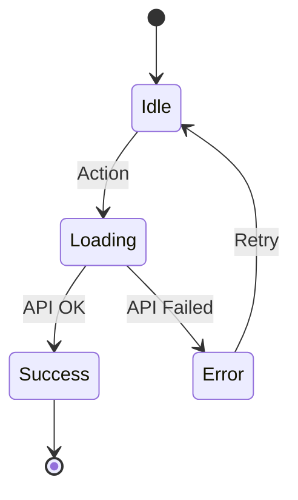

# PaperGenie - State Chart Diagrams

This folder contains Mermaid state chart diagrams documenting the various state machines and user flows in the PaperGenie application.

## Diagram Files

| File | Description |
|------|-------------|
| [01-authentication-flow.mmd](01-authentication-flow.mmd) | User authentication states including login, signup, and session management |
| [02-assessment-generation-flow.mmd](02-assessment-generation-flow.mmd) | Assessment creation wizard with form steps and validation |
| [03-my-assessments-flow.mmd](03-my-assessments-flow.mmd) | Assessment list view with filtering, expanding, and CRUD operations |
| [04-curriculum-manager-flow.mmd](04-curriculum-manager-flow.mmd) | Curriculum management including file upload to Firebase |
| [05-sidebar-navigation-flow.mmd](05-sidebar-navigation-flow.mmd) | Sidebar toggle states and navigation structure |
| [06-global-app-state-flow.mmd](06-global-app-state-flow.mmd) | Overall application state and Zustand store management |
| [07-api-request-lifecycle.mmd](07-api-request-lifecycle.mmd) | Standard API request/response handling pattern |
| [08-form-validation-states.mmd](08-form-validation-states.mmd) | Form validation rules for all forms in the application |

## How to View

### Option 1: VS Code Extension
Install the **Markdown Preview Mermaid Support** extension in VS Code to preview `.mmd` files.

### Option 2: Mermaid Live Editor
Copy the content of any `.mmd` file to [Mermaid Live Editor](https://mermaid.live/) to visualize and export as PNG/SVG.

### Option 3: GitHub
GitHub automatically renders Mermaid diagrams in `.md` files. Wrap the content in:
```markdown
```mermaid
<diagram content>
```
```

## Diagram Legend

### State Types
- `[*]` - Initial/Final state
- `state StateName { }` - Composite state with substates
- `-->` - State transition

### Common Patterns Used



## Application Architecture Summary

```
┌─────────────────────────────────────────────────────────────────┐
│                         PaperGenie                               │
├─────────────────────────────────────────────────────────────────┤
│  Frontend (Next.js)                                              │
│  ├── Pages: Landing, Login, Signup, Dashboard/*                  │
│  ├── Components: Forms, Sidebar, Cards, Tables                   │
│  ├── State: Zustand (user info), React useState (local)         │
│  └── UI: shadcn/ui + Tailwind CSS                               │
├─────────────────────────────────────────────────────────────────┤
│  API Routes (Next.js API)                                        │
│  ├── /api/auth/* - Authentication endpoints                      │
│  ├── /api/assessment/* - Assessment CRUD                         │
│  └── /api/curriculum/* - Curriculum CRUD                         │
├─────────────────────────────────────────────────────────────────┤
│  Backend Services                                                │
│  ├── MongoDB - Data persistence                                  │
│  ├── JWT - Authentication tokens                                 │
│  ├── Firebase Storage - File uploads                             │
│  └── ChromaDB - Vector embeddings for search                     │
└─────────────────────────────────────────────────────────────────┘
```

## Key State Flows

### 1. Authentication Flow
```
Unauthenticated → Login/Signup → Token Stored → Authenticated → Dashboard
```

### 2. Assessment Generation Flow
```
Initial Form → Inner Form → Validation → API Call → Success/Error
```

### 3. Data Loading Pattern
```
Page Mount → Loading State → Fetch API → Success (Display) / Error (Retry)
```

### 4. Form Submission Pattern
```
Idle → Validating → Loading → Success (Toast + Redirect) / Error (Toast + Retry)
```
